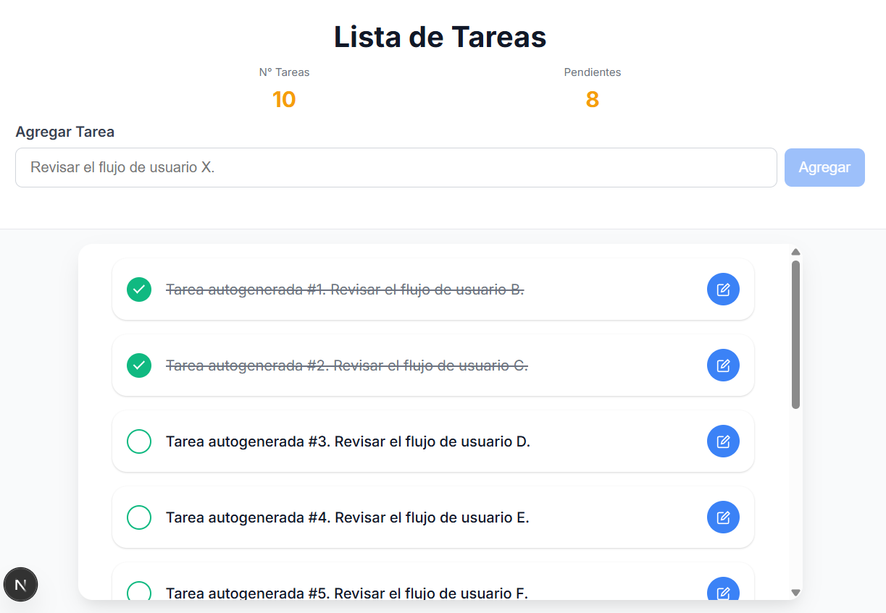

# 📋 Task List - Next.js

Task list application developed with Next.js, React and styled-components.

## 📸 Screenshot



## 🚀 Quick Start

### Installation
```bash
npm install
# or
npm i
```

### Development
```bash
npm run dev
```
The application will open automatically at [http://localhost:3000](http://localhost:3000) in your browser.

### Testing
```bash
npm test
```

## 📁 Project Structure

```
src/
├── app/                    # Next.js App Router
│   ├── layout.tsx         # Main layout
│   └── page.tsx           # Main page
├── components/            # React components
│   ├── taskError/     # Error component
│   ├── taskHeader/    # Header with statistics
│   ├── icons/             # Custom icons
│   └── taskManager/          # Main task list
│       ├── __tests__/     # Component tests
│       ├── TaskManager.tsx   # Main component
│       ├── useTaskManager.ts # Custom hook
│       └── taskManager.styles.ts # Styled-components styles
├── mockApi/               # Mock API for development
└── test/                  # Test configuration
```

## 🧪 Testing

The project uses **Vitest** and **React Testing Library** for testing:

- **Configuration**: `vitest.config.js` and `test/setup.ts`
- **Tests**: Located in `__tests__/` within each component
- **Run**: `npm test`

### Test Example
```typescript
// Verifies that the mark task button works correctly
test('marks a task as completed', async () => {
  // ... test logic
});
```

## 🛠️ Technologies

- **Next.js 14** - React framework
- **React** - UI library
- **Styled-components** - CSS-in-JS styling
- **Vitest** - Testing framework
- **React Testing Library** - Component testing

## 📝 Features

- ✅ Interactive task list
- 📊 Real-time statistics
- 🎨 Modern design with styled-components
- ✏️ Edit functionality
- 🧪 Automated tests
- 📱 Responsive design

